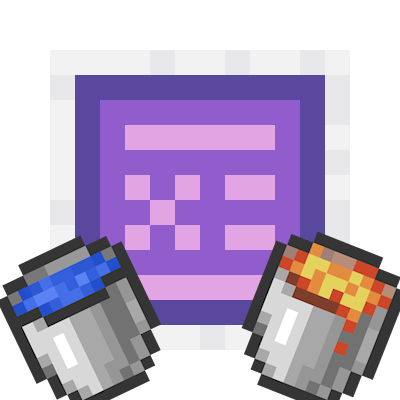

      

<h1 align="center">AE2 Fluid Crafting Terminal</h1>

    
    
  

## Feature
AE2 Fluid Crafting Terminal is an addon for Applied Energistics 2 that simplifies and enhances the fluid crafting experience. It provides a dedicated terminal and improved mechanics to handle fluids as naturally as items within your ME network.
## Minecraft 26.1.2

- Requires Java 25, NeoForge 26.1.2.99 or newer, AE2 26.1.10-beta or newer, and Myotus 26.0.0.
- Supports JEI 29.33.0.87 or newer and REI 26.1.819. EMI and ExtendedTerminal integration are not included in this port.
- AE2 fluid-key recipe lookup uses the recipe viewer's keyboard shortcuts. Left-click retains AE2's bucket-filling behavior.
- This branch currently produces development snapshots, not a published release.

Run `gradlew.bat runGameTestServer` for the virtual-fluid ingredient and capability regression check. The test-only mod is excluded from normal runs and the release JAR. Terminal rendering, recipe-viewer shortcuts, and config-tab interaction still require an in-game check.

Run `gradlew.bat runRenderTestClient` and enter a disposable development world to check virtual-fluid GUI rendering. The client renders water and lava, saves `build/reports/port-verification/virtual-fluid-render.png`, and exits after checking the icon pixels.

## License
code: LGPL 3.0
